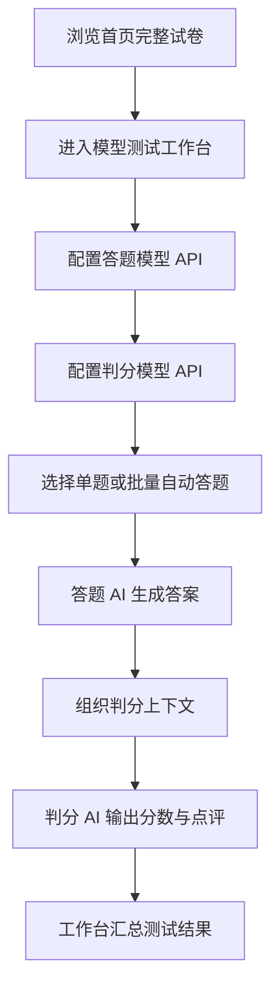

## 1. 产品概述
这是一个面向竞赛、练习与测试场景的 AI 自动答题网站，用户只需配置大模型 API，即可对题目自动生成答案，并由第二个 AI 对答案进行判分与点评。
- 解决题目批量作答、结果快速评估、模型效果对比与 prompt 调优的需求，适用于出题方、测试方、内容运营和个人实验用户。
- 产品价值在于把“题目输入 -> AI 作答 -> AI 判分 -> 结果沉淀”串成闭环，降低人工测试成本，提升模型验证效率。

## 2. 核心功能

### 2.1 用户角色
| 角色 | 接入方式 | 核心权限 |
|------|----------|----------|
| 管理员/操作者 | 本地进入站点 | 配置模型 API、导入题目、执行自动答题、查看判分结果、导出记录 |

### 2.2 功能模块
1. **工作台首页**：项目介绍、当前配置概览、快速开始入口。
2. **模型测试工作台**：配置答题模型与判分模型、选择试题、执行自动答题、集中查看测试结果。

### 2.3 页面详情
| 页面名称 | 模块名称 | 功能描述 |
|-----------|-----------|-----------|
| 首页 | 试卷正文 | 直接完整展示“第一卷”试题，按题型与分值分节排版，并使用 LaTeX 公式渲染保证数学表达准确 |
| 模型测试工作台 | 模型配置区 | 配置答题模型与判分模型的 Base URL、API Key、模型名、提示词与采样参数 |
| 模型测试工作台 | 试题选择区 | 按题号浏览整卷试题，选择单题或批量发起测试 |
| 模型测试工作台 | 测试结果区 | 展示答题模型输出、判分模型评分与点评、全部题目的运行状态汇总 |

## 3. 核心流程
用户进入站点后，首页先浏览完整试卷，再进入工作台配置答题模型和判分模型。系统调用答题 AI 生成答案，随后把题目、AI 答案和评分规则一起发送给判分 AI，最终在同一工作台汇总展示测试结果。

## 4. 用户界面设计
### 4.1 设计风格
- 主色采用浅米白背景、深灰文字、低饱和蓝色做交互强调，整体偏试卷阅读与工具台风格。
- 按钮使用简洁圆角与轻边框，不做重装饰。
- 标题字体稳重清晰，正文优先可读性，保证长题干阅读舒适。
- 首页采用文档式排版，工作台采用分栏结构，突出配置与结果本身。
- 图标只用于必要的导航与状态，不堆叠装饰元素。

### 4.2 页面设计概览
| 页面名称 | 模块名称 | UI 元素 |
|-----------|-----------|-----------|
| 首页 | 试卷正文 | 试卷标题、题型分节标题、题号、选项、填空与解答题正文 |
| 模型测试工作台 | 左侧配置面板 | API 配置表单、提示词编辑器、执行按钮 |
| 模型测试工作台 | 右侧测试面板 | 题目选择列表、答案输出、判分结果、状态汇总表 |

### 4.3 响应式设计
采用桌面优先设计，兼容平板与移动端查看。移动端主要保证配置表单与结果卡片可读，复杂批量操作以桌面端体验为主。

### 4.4 3D 场景指引
本项目不要求 3D 场景，重点放在信息密度、状态反馈与操作流畅度。
