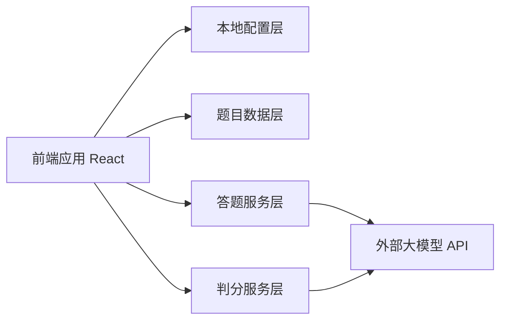
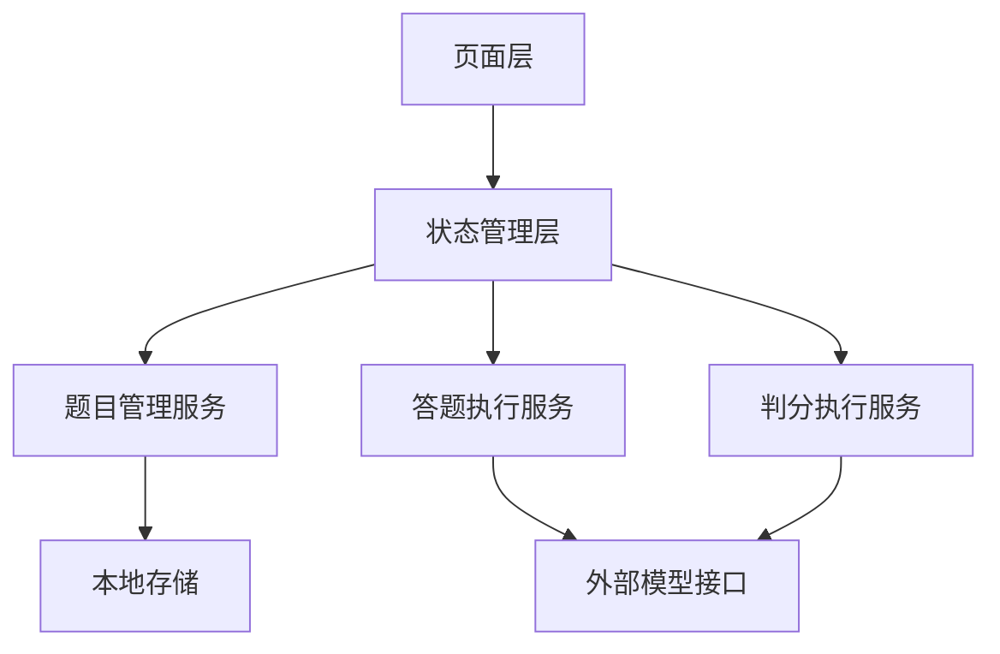
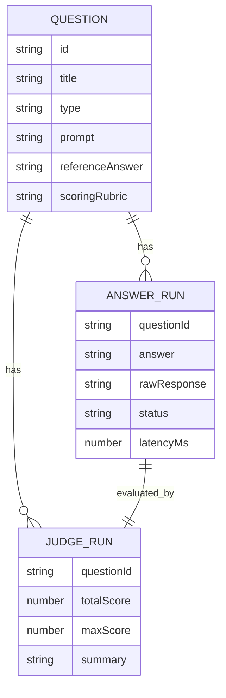

## 1. 架构设计


前端应用以单页应用形式运行，优先采用纯前端架构，减少额外后端依赖。题目、配置与运行记录先保存在浏览器本地存储中，后续可扩展到服务端持久化。首版默认随应用内置“第一卷”完整题库，并在本地存储中支持后续替换与增量导入。

## 2. 技术说明
- 前端：React@18 + TypeScript + Vite
- 样式：Tailwind CSS@3
- 数学公式渲染：KaTeX + react-latex-next
- 状态管理：React Context + 本地 hooks
- 数据持久化：localStorage
- 网络请求：Fetch API
- 初始化工具：Vite

## 3. 路由定义
| 路由 | 用途 |
|------|------|
| / | 首页，完整展示第一卷试卷正文 |
| /workspace | 模型 API 测试工作台，集中展示答题与判分结果 |

## 4. API 定义
本项目默认直接兼容 OpenAI 风格的 Chat Completions 接口，通过可配置 `baseURL` 适配不同模型供应商。

### 4.1 核心类型定义
```ts
type ModelProviderConfig = {
  id: string;
  name: string;
  baseUrl: string;
  apiKey: string;
  model: string;
  systemPrompt: string;
  temperature: number;
  maxTokens: number;
};

type QuestionItem = {
  id: string;
  title: string;
  type: "single" | "multiple" | "judge" | "short" | "essay" | "custom";
  prompt: string;
  options?: string[];
  referenceAnswer?: string;
  scoringRubric?: string;
  tags?: string[];
  difficulty?: string;
};

type AnswerRunResult = {
  questionId: string;
  answer: string;
  rawResponse: string;
  status: "idle" | "running" | "success" | "failed";
  latencyMs?: number;
  errorMessage?: string;
};

type JudgeResult = {
  questionId: string;
  totalScore: number;
  maxScore: number;
  dimensions: Array<{
    name: string;
    score: number;
    reason: string;
  }>;
  summary: string;
  confidence?: number;
};
```

### 4.2 请求结构
`POST {baseUrl}/chat/completions`

请求体示例：
```json
{
  "model": "gpt-4.1",
  "temperature": 0.2,
  "messages": [
    {
      "role": "system",
      "content": "你是自动答题助手，请严格输出最终答案。"
    },
    {
      "role": "user",
      "content": "题目内容..."
    }
  ]
}
```

判分请求将包含题目、参考答案、评分标准、AI 生成答案，要求返回结构化 JSON，便于前端直接渲染。

## 5. 服务架构图
纯前端版本不单独引入业务后端，服务职责在前端内部按模块拆分：



## 6. 数据模型
### 6.1 数据模型定义


### 6.2 数据定义语言
本地版本不使用数据库，采用以下本地存储键：

```ts
const STORAGE_KEYS = {
  answerModelConfig: "ai-quiz.answer-model-config",
  judgeModelConfig: "ai-quiz.judge-model-config",
  questionBank: "ai-quiz.question-bank",
  answerRuns: "ai-quiz.answer-runs",
  judgeRuns: "ai-quiz.judge-runs"
} as const;
```

后续若需要多人协作、服务端审计或运行任务队列，可扩展 Node.js API 层与数据库存储，但首版先保持部署和使用门槛最低。
